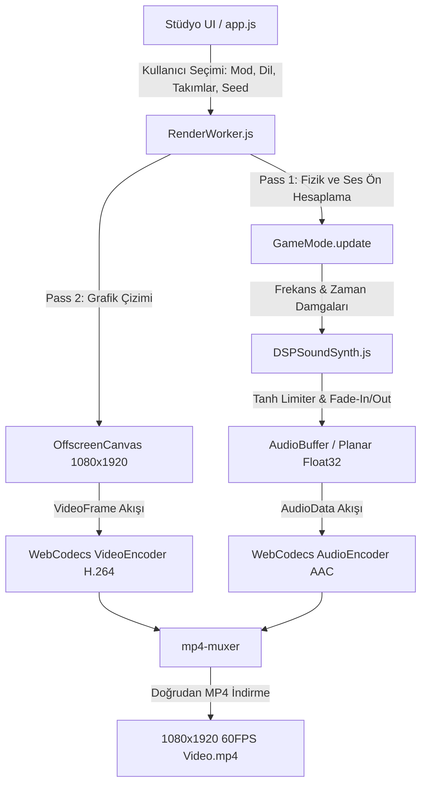

# ⚡ Neon Shorts Engine — 25 Modlu Otonom Viral Video Fabrikası

[](https://vitejs.dev/)
[](https://w3c.github.io/webcodecs/)
[-ff0055?style=for-the-badge)](#)
[](#)
[](#)
[](#)
[](#)
[](LICENSE)

**Neon Shorts Engine**, YouTube Shorts, TikTok ve Instagram Reels algoritmalarını hipnotik fizik simülasyonları ile domine etmek için tasarlanmış **donanım hızlandırmalı, sıfır bağımlılıklı ve otonom bir dikey video üretim fabrikasıdır.**

Tarayıcı tabanlı `WebCodecs` ve `OffscreenCanvas` teknolojileri sayesinde harici bir video düzenleme programına (After Effects, Premiere vb.) ihtiyaç duymadan, doğrudan donanımınızın GPU gücünü kullanarak saniyeler içinde **1080x1920 60 FPS**, saf matematiksel ASMR sesli ve tam uyumlu `.mp4` formatında dikey videolar üretir.

---

## 📑 İçindekiler
1. [Öne Çıkan Yetenekler](#-öne-çıkan-yetenekler)
2. [Sistem Mimarisi ve Çekirdek Teknolojiler](#-sistem-mimarisi-ve-çekirdek-teknolojiler)
3. [25 Viral Oyun Modu Kataloğu](#-25-viral-oyun-modu-kataloğu)
4. [DSP Ses Sentezleyici (Telifsiz ASMR)](#-dsp-ses-sentezleyici-telifsiz-asmr)
5. [9:16 Güvenli Alan (Safe Zone) Mimarisi](#-916-güvenli-alan-safe-zone-mimarisi)
6. [5 Dilde Küresel İçerik Üretimi (i18n)](#-5-dilde-küresel-i̇çerik-üretimi-i18n)
7. [Kurulum ve Çalıştırma](#-kurulum-ve-çalıştırma)
8. [Kullanım Rehberi & Toplu Üretim](#-kullanım-rehberi--toplu-üretim)
9. [Otomasyon ve Test Süiti](#-otomasyon-ve-test-süiti)
10. [Proje Dizin Yapısı](#-proje-dizin-yapısı)

---

## 🌟 Öne Çıkan Yetenekler

* 🎮 **25 Özgün Viral Oyun Modu:** İzleyici tutma (retention) oranını %85'in üzerinde tutmak için özel olarak tasarlanmış 25 farklı hipnotik oyun simülasyonu.
* ⚡ **Çift Geçişli (Two-Pass) Deterministik Render:** `PRNG` (Sözde Rastgele Sayı Üretici) seed sistemi sayesinde ses dalgaları ve görsel kareler milisaniye seviyesinde kusursuz eşzamanlanır.
* 🔊 **Saf Matematiksel DSP Ses Motoru:** Sıfır harici WAV/MP3 dosyası! Tüm sesler (pentatonik plinkler, tok bas vuruşları, cam kırılmaları, gerilim süpürmeleri) `Float32Array` planar belleğinde doğrudan frekans formülleriyle sentezlenir.
* 🚀 **Web Worker İzolasyonu:** 1680 karelik video render işlemi arka planda çalışan Web Worker havuzunda işlenirken stüdyo arayüzü takılmadan 60 FPS canlı akmaya devam eder.
* 🌐 **5 Küresel Dil Desteği:** Türkçe, İngilizce, İspanyolca, Portekizce ve Almanca dil seçenekleriyle küresel kitleye anında erişim.
* 📦 **Anti-Spam Dinamik Metadata Fabrikası:** Her video için YouTube ve TikTok SEO kurallarına uygun dinamik kanca başlıkları, açıklamalar ve etiketler (`Day_X_info.txt`) üretilir.

---

## 🏗️ Sistem Mimarisi ve Çekirdek Teknolojiler



### 1. 480 Hz Alt-Adımlı Fizik Motoru (Sub-Stepping)
Klasik 60 FPS motorlarda yüksek hızda hareket eden parçacıklar duvarların ve engellerin içinden geçebilir (tünelleme hatası). Neon Shorts Engine, her render karesini kendi içinde alt fizik adımlarına bölerek tam elastik çarpışma, açısal momentum ve kütleçekim doğruluğu sağlar.

### 2. Donanım Hızlandırmalı WebCodecs & Muxer
Video işleme tarayıcı içinde yazılımsal CPU derlemesiyle değil, GPU üzerindeki donanım kodlayıcıları (`VideoEncoder` - H.264 High Profile @ Level 5.2) çağrılarak yapılır. 28 saniyelik 60 FPS bir video modern donanımlarda **12 ila 18 saniye içinde** diske yazılır.

---

## 🎮 25 Viral Oyun Modu Kataloğu

| # | İkon | Mod Adı | Fizik ve Oyun Mekaniği | ASMR / DSP Ses Karakteristiği |
|:---:|:---:|:---|:---|:---|
| **1** | ⚔️ | **Bölge Savaşı (Territory War)** | 700+ hücrelik haritada 2-4 takımın piksel kapmaca mücadelesi | Hızlı pentatonik plink melodileri |
| **2** | 🔢 | **Çarpan Kapıları (Multiplier Gates)** | x2, x3 ve +25 kapılarından geçerek katlanan top şelalesi | Yükselen arpej ve Jackpot çanı |
| **3** | 🌀 | **Altıgen Labirent (Hexagon Escape)** | İç içe zıt yönlerde dönen 5 altıgen katmandan kaçış | Hipnotik bas rezonansı ve tıkırtılar |
| **4** | ⭕ | **Dönen Halka (Circle Escape)** | Hızlanan neon topun halka segmentlerini aşındırması | Cam kırılma ve tok geri tepme |
| **5** | 🎰 | **Plinko Kaosu (Plinko Cascade)** | Pirinç çiviler arasında süzülen 80+ top ve çarpan hazneleri | Metalik tınılar ve yoğun kaskad |
| **6** | 💀 | **Battle Royale** | Merkeze daralan elektrik fırtınası ve son kalan top | Gerilim süpürmesi ve kalp atışı |
| **7** | 🏰 | **Kule Parçalama (Tower Crush)** | Yıkım toplarıyla mega trambolinden kule bloklarına hücum | Ağır bas patlamaları ve blok enkazı |
| **8** | 🕳️ | **Kara Delik (Black Hole)** | Olay ufkundan kaçmaya çalışan roketli topların yörünge savaşı | Düşük frekanslı yerçekimi uğultusu |
| **9** | 🪜 | **Merdiven Yarışı (Stair Race)** | 32 basamaklı dikey piramitte trambolinlerle zirveye tırmanış | Basamak basamak yükselen armonikler |
| **10** | ⚡ | **Lazer Çapraz Ateşi (Laser Crossfire)** | Ekranı tarayan dönen neon lazer ızgarasını aşma mücadelesi | Buharlaşma cızırtısı ve lazer enerjisi |
| **11** | 🪚 | **Testere Parkuru (Sawblade Gauntlet)** | Dönen dev dişli testerelerin arasından alt güvenli bölgeye iniş | Kıvılcım çatırtıları ve alarm zili |
| **12** | 🀄 | **Domino Şelalesi (Domino Cascade)** | 220 parçalık dev sarmal domino diziliminin zincirleme çöküşü | Sıralı ritmik tıkırtılar ve altın gong |
| **13** | 🔨 | **Sarkaç Çekiçleri (PendulumHammers)** | Fiziksel salınım yapan dev tokmakların arasından sıyrılma | Tok darbe vuruşları ve kurtuluş zili |
| **14** | 🪢 | **Halat Çekmece (Tug of War)** | Enerji düğümünü kendi sınırına çekmek için çarpışan takımlar | Yüksek enerjili statik deşarj |
| **15** | 💣 | **Saatli Bomba (Time Bomb)** | Çarpışmayla birbirine aktarılan fitilli bomba; son kalan kazanır | Hızlanan kalp atışı ve patlama |
| **16** | 🧗 | **Duvar Tırmanışı (Wall Climb)** | Eşit genişlikteki şeritlerde zikzak sekerek zirve ziline koşu | Tırmanış melodisi ve zirve zaferi |
| **17** | ❄️ | **Buz vs Lav (Ice vs Lava)** | İki zıt elementin sınır itme savaşı ve termal çatışma | Buhar patlamaları ve kristal tonları |
| **18** | 🦠 | **Hücre Bölünmesi (Cell Mitosis)** | Prizmalara çarptıkça geometrik katlanan hücre kolonisi | Kristalize pentatonik ASMR tonları |
| **19** | 🧲 | **Manyetik Kutuplar (Magnetic Polarity)**| Dönen manyetik kutuplar, elektrik arkları ve Coulomb kuvveti | Manyetik vızıltı ve yüksek voltaj arkı |
| **20** | 🪙 | **Çılgın Pachinko (Pachinko Madness)** | Klasik Tokyo usulü lale hazneleri ve Fever modu fırtınası | Çan melodisi ve madeni para şıngırtısı |
| **21** | 🌀 | **Boyut Kapıları (Portal Paradox)** | Momentum koruyarak portallar arasında sonsuz yerçekimi sapanı | Kuantum bükülme ve ışınlanma sesi |
| **22** | 🔄 | **Yerçekimi Kaosu (Gravity Inversion)**| Her 3 saniyede 4 yöne değişen yerçekimi vektörleri | Faz kayması ve yön değişim uyarısı |
| **23** | 🌀 | **Arşimet Spirali (Archimedes Spiral)**| Açısal momentum ile merkeze hızla çekilen sarmal yarış | Girdap süpürmesi ve çekirdek zaferi |
| **24** | 🕹️ | **Siber Pinball (Cyber Pinball)** | Otomatik vuran çift flipper, neon tamponlar ve kombo çarpanı | Retro arcade bip ve yay fırlatması |
| **25** | 🗼 | **Sarmal Kule İnişi (Helix Fall)** | 3D dönen kuleden deliklerden geçerek Fireball parçalaması | Katman kırma çıtırtısı ve kombo tonu |

---

## 🔊 DSP Ses Sentezleyici (Telifsiz ASMR)

Sesler hiçbir harici ses kütüphanesine veya telifli müzik dosyasına bağlı değildir. `src/core/SoundSynth.js` sınıfı doğrudan tarayıcının DSP katmanında matematiksel formüller çalıştırır:

* **Pentatonik Skala:** İnsan kulağına en rahatlatıcı ve hipnotik gelen $A_4$ tabanlı (220 Hz - 880 Hz) frekans serisi.
* **Tanh Yumuşak Sınırlayıcı (Soft Limiter):** Yüzlerce top aynı anda çarptığında ses dalgasının genliği $\tanh(x)$ fonksiyonundan geçirilerek dijital kırpılma (clipping/distortion) tamamen önlenir:
  $$\text{output} = \tanh(\text{input})$$
* **Sıfır-Klik (Zero-Click Fade):** Sesin başlangıç ve bitişine uygulanan 40 milisaniyelik zarf (envelope), kulaklıkta patlama veya tıkırtı oluşmasını engeller.

---

## 📱 9:16 Güvenli Alan (Safe Zone) Mimarisi

Dikey sosyal medya platformlarının (TikTok, Reels, Shorts) ekran üzeri butonları video içeriklerinin üzerine biner. Bu durumu engellemek için `src/config/SafeZone.js` matematiksel bir emniyet kafesi oluşturur:

```
+---------------------------------------------------+  Y: 0
|        ÜST BİLGİ ALANI (Arama Çubuğu / Canlı)      |
|  +---------------------------------------------+  |  Y: 160 (Safe Zone Başlangıcı)
|  |                                             |  |
|  |                                             |  |
|  |           870 x 1360 PİKSEL                 |  |
|  |         NET OYUN & AKSİYON ALANI            |  |  (X: 70 -> X: 940)
|  |                                             |  |
|  |                                             |  |
|  +---------------------------------------------+  |  Y: 1520 (Safe Zone Bitişi)
|      ALT ETKİLEŞİM ALANI (Açıklama, Müzik, Ses)     |
+---------------------------------------------------+  Y: 1920
```

Tüm HUD göstergeleri, oyun elementleri ve skor tabelaları bu güvenli sınırların içinde kalır; hiçbir platform arayüzü içeriği kapatamaz.

---

## 🌍 5 Dilde Küresel İçerik Üretimi (i18n)

Sistem tek bir tıklama ile tüm stüdyo arayüzünü ve video içi metinleri 5 ana dile çevirir:
* 🇹🇷 **Türkçe (TR)**
* 🇬🇧 **English (EN)**
* 🇪🇸 **Español (ES)**
* 🇵🇹 **Português (PT)**
* 🇩🇪 **Deutsch (DE)**

Video ile beraber üretilen `Day_X_info.txt` dosyası, seçilen dilde viral kancaları, açıklama metinlerini ve yüksek etkileşimli etiketleri hazır olarak sunar.

---

## 🚀 Kurulum ve Çalıştırma

### Gereksinimler
* [Node.js](https://nodejs.org/) v18.0 veya üzeri
* Donanım hızlandırmalı modern bir Chromium tarayıcı (Google Chrome, Microsoft Edge, Brave)

### 1. Projeyi Klonlayın ve Bağımlılıkları Yükleyin
```bash
git clone https://github.com/BurakYildizGameDev/neon-shorts-engine.git
cd neon-shorts-engine
npm install
```

### 2. Testleri Koşun
```bash
npm test
```
*Tüm matematik, fizik, determinizm, i18n ve canvas güvenliği test edilir (15/15 Pass).*

### 3. Geliştirme Sunucusunu Başlatın
```bash
npm run dev
```
Tarayıcınızda `http://localhost:5173` adresine giderek stüdyoyu kullanmaya başlayın.

### 4. Prodüksiyon Derlemesi
```bash
npm run build
```
Çıktı `dist/` klasörüne optimize edilmiş statik dosyalar olarak derlenir.

---

## 🎬 Kullanım Rehberi & Toplu Üretim

1. **Oyun Modunu Seçin:** Sol menüdeki 25 karttan dilediğiniz moda tıklayın.
2. **Takım / Ülke Belirleyin:** Bölge Savaşı ve Halat Çekme modları için hazır seçeneklerden (Derbi, Dünya Kupası, Süper Lig) birini seçin veya özel isimlerinizi girin.
3. **Çıktı Klasörünü Yetkilendirin:** `[ 📁 Çıktı Klasörünü Seç ]` butonuna basarak videoların otomatik indirileceği yerel klasörü seçin.
4. **Tek Video Render:** `[ 🎬 VİDEOYU ÜRET (MP4) ]` butonuna basın. Arka plandaki Web Worker ~15 saniyede 1680 kareyi render edip MP4 olarak kaydeder.
5. **7 Günlük Seri Üretim:** `[ ⚡ 7 GÜNLÜK SERİ PAKETİ ÜRET ]` butonuna basarak 7 farklı tohum (seed) ile 1 haftalık içerik stoğunuzu tek seferde hazırlayın.

---

## 🧪 Otomasyon ve Test Süiti

Proje, Node.js yerel test motoru (`node:test`) ile korunan kapsamlı bir kalite süitine sahiptir:

```bash
$ npm test

✔ i18n - 5 Dil Desteği ve 25 Modluk Sözlük Bütünlüğü
✔ i18n - Parametre İnterpolasyonu ve Dil Değişimi
✔ DynamicMetadata - 5 Dilde Metadata Üretimi
✔ DynamicMetadata - 100 Günlük Döngü ve Çeşitlilik Testi
✔ ModeManager - 25 Oyun Modunun Eksiksiz Tanımlanması
✔ ModeManager - Tüm 25 Modun Başlatılması, İlk Kare (Frame 0) Render ve 120 Kare Simülasyonu
✔ ModeManager - Farklı Seed ile Determinizm ve Başlatma Testi
✔ PRNG - Determinizm Testi (Aynı seed aynı sayıları üretmeli)
✔ PRNG - Farklı seedler farklı sayılar üretmeli
✔ PRNG - range(), rangeInt() ve choice() kontrolü
✔ SafeZone - 9:16 Dikey Çözünürlük ve Boyut Standartları
✔ SafeZone - TikTok & Shorts Güvenli Alan Matematiksel Doğruluğu
✔ DSPSoundSynth - Tampon Boyutları ve Planar Bellek Yerleşimi
✔ DSPSoundSynth - Tanh Limiter Sınır Güvenliği [-1.0, 1.0]
✔ DSPSoundSynth - Sıfır Klik (Zero-Click) Fade-In ve Fade-Out

ℹ tests 15 | pass 15 | fail 0 | duration_ms ~450ms
```

---

## 📁 Proje Dizin Yapısı

```
neon-shorts-engine/
├── index.html                   # 9:16 Dikey Stüdyo Arayüzü & Kontrol Paneli
├── package.json                 # Bağımlılıklar ve Komutlar
├── vite.config.js               # Vite Yapılandırması
├── HOW_TO_USE.pdf               # Profesyonel A4 Formatında 3 Sayfalık Kullanım Rehberi
├── HOW_TO_USE.txt               # Hızlı Metin Rehberi
├── src/
│   ├── config/
│   │   └── SafeZone.js          # 9:16 Güvenli Bölge Geometrisi ve Emniyet Sınırları
│   ├── core/
│   │   └── SoundSynth.js        # Matematiksel DSP Ses Motoru ve Tanh Limiter
│   ├── exporter/
│   │   └── RenderWorker.js      # Web Worker, OffscreenCanvas ve WebCodecs Kodlayıcı
│   ├── generator/
│   │   ├── DynamicMetadata.js   # 5 Dilde Anti-Spam SEO Başlık & Açıklama Üretici
│   │   └── PRNG.js              # Deterministik LCG Sözde Rastgele Sayı Üretici
│   ├── i18n/
│   │   └── translations.js      # 5 Dil Sözlüğü (TR, EN, ES, PT, DE)
│   ├── modes/
│   │   ├── ModeManager.js       # 25 Oyun Modunun Kayıt ve Yaşam Döngüsü Yöneticisi
│   │   ├── TerritoryWar.js      # Mod 1: Bölge Savaşı
│   │   ├── MultiplierGates.js   # Mod 2: Çarpan Kapıları
│   │   ├── HexagonEscape.js     # Mod 3: Altıgen Labirent
│   │   ├── CircleEscape.js      # Mod 4: Dönen Halka
│   │   ├── PlinkoCascade.js     # Mod 5: Plinko Kaosu
│   │   ├── BattleRoyale.js      # Mod 6: Battle Royale
│   │   ├── TowerCrush.js        # Mod 7: Kule Parçalama
│   │   ├── BlackHole.js         # Mod 8: Kara Delik
│   │   ├── StairRace.js         # Mod 9: Merdiven Yarışı
│   │   ├── LaserCrossfire.js    # Mod 10: Lazer Çapraz Ateşi
│   │   ├── SawbladeGauntlet.js  # Mod 11: Testere Parkuru
│   │   ├── DominoCascade.js     # Mod 12: Domino Şelalesi
│   │   ├── PendulumHammers.js   # Mod 13: Sarkaç Çekiçleri
│   │   ├── TugOfWar.js          # Mod 14: Halat Çekmece
│   │   ├── TimeBomb.js          # Mod 15: Saatli Bomba
│   │   ├── WallClimb.js         # Mod 16: Duvar Tırmanışı
│   │   ├── IceVsLava.js         # Mod 17: Buz vs Lav
│   │   ├── CellMitosis.js       # Mod 18: Hücre Bölünmesi
│   │   ├── MagneticPolarity.js  # Mod 19: Manyetik Kutuplar
│   │   ├── PachinkoMadness.js   # Mod 20: Çılgın Pachinko
│   │   ├── PortalParadox.js     # Mod 21: Boyut Kapıları
│   │   ├── GravityInversion.js  # Mod 22: Yerçekimi Kaosu
│   │   ├── ArchimedesSpiral.js  # Mod 23: Arşimet Spirali
│   │   ├── CyberPinball.js      # Mod 24: Siber Pinball
│   │   └── HelixFall.js         # Mod 25: Sarmal Kule İnişi
│   └── ui/
│       ├── app.js               # Canlı Önizleme Döngüsü, Etkinlikler ve Worker İletişimi
│       └── style.css            # Siberpunk / Neon Karanlık Tema Stilleri
└── tests/
    ├── dynamicMetadata.test.js  # Metadata Üretim Testleri
    ├── i18n.test.js             # 5 Dil Sözlük ve Çeviri Testleri
    ├── modeManager.test.js      # 25 Modun Finite Canvas & Simülasyon Testleri
    ├── prng.test.js             # PRNG Determinizm Testleri
    ├── safeZone.test.js         # Güvenli Alan Matematik Testleri
    └── soundSynth.test.js       # DSP Ses ve Tanh Sınırlayıcı Testleri
```

---

## 📄 Lisans
Bu proje **[MIT Lisansı](LICENSE)** ile lisanslanmıştır. Dilediğiniz gibi geliştirebilir, ticari projelerinizde veya sosyal medya kanallarınızda dilediğiniz gibi kullanabilirsiniz.
